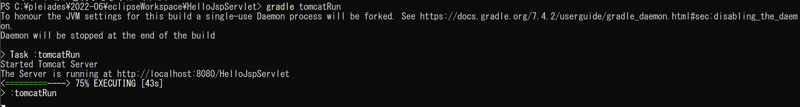

# Eclipse による Web アプリケーション開発の流れ

### 今回動かすアプリケーション

ブラウザから入力した文字をコンソールに出力するアプリケーション

## 1. **Gradle プロジェクトの作成**

1. [ファイル] -> [新規] -> [Gradle プロジェクト]を選択しプロジェクト名に HelloJspServlet を記入し，[次へ]を選択する．\*見つからない場合は, [ファイル] -> 「新規」 -> [その他] -> [Gradle] -> [Gradle プロジェクト]
2. オプション画面で「ワークスペース設定を上書き」にチェックをいれ，「Gradle バージョンの指定」から「7.1」に選び，[次へ]を選択する．
3. プレビュー画面で，Gradle のバージョンが 「7.1」であることを確認し，[完了]を選択する．

## 2. **フォルダー・パッケージ・ファイルの作成**

1.  1 で作成したプロジェクトを開き，「src/main/java/」で右クリックする
2.  「新規」→「パッケージ」の順に選択する
3.  「名前」と書かれたテキストボックスに「servlet」と入力し，「完了」を選択する．

## 3. **各プログラムファイルの作成**

    3 つのファイルを作成する
    1.  プロジェクト(HelloJspServlet)配下に新規　 → ファイルを選択し「gradle.properties」を作成する
    2.  2-2 で作成した servlet パッケージを右クリックして，新規 → ファイルを選択して，ファイル名に Hello.java と入力して，完了ボタンを押す
    3.  プロジェクトにある src->main->webapp と辿っていき，webapp を右クリックして，新規->ファイルを選択し，ファイル名に index.jsp を作成する

## 4. **ファイルに内容を埋める**

    WebClass(Teams) から HelloJspServlet.zip をダウンロードして解凍する.
    その後に解凍したファイルから以下のファイルにコピー&ペーストする
    1.  index.jsp
    2.  build.gradle
    3.  gradle.properties
    4.  Hello.java

## 5. **アプリケーションを実行する**

コマンドプロントで作成したプロジェクトのディレクトリまで移動し，「gradle tomcatRun」と入力しエンターを押す．数十秒ほど待機すると下記のような画面になるので，表示された URL(http://localhost:8080/HelloJspServlet)をコピーしてブラウザのアドレス欄に入力すると確認ができます
「Ctrl + c」(を 2 回)で停止できます

---
