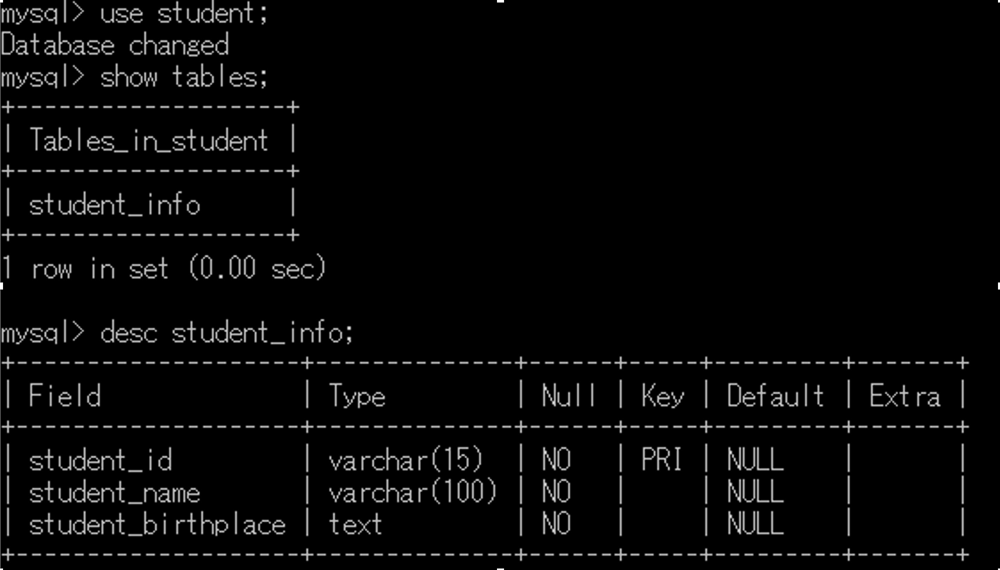

# Eclipse による Web アプリケーション開発の流れ(DB 接続まで)

### 今回動かすアプリケーション(プロジェクト名: StuInfo)

**主要な機能**

- 学籍番号, 氏名, 出身地の登録
- 学籍番号入力による学生情報の検索

## 1. Gradle プロジェクトのインポート

1. [ファイル]→[インポート]→[Gradle]→[既存の Gradle プロジェクト]と進んで, 次> を選択する
2. 参照から, ダウンロード, 解凍した時にできたフォルダの 1 つ下の回想のものを選択し, 次>を選択する．インポート・プレビューの画面を完了を選択する.

## 2. Mysql で DB を作成

1. DB 作成
   ```sql
   create database student;
   ```
2. table 作成

   ```sql
   create table student_info(student_id varchar(15) primary key, student_name varchar(100), student_birthplace text);
   ```

   出来上がるテーブルの仕様は以下になる
   

## 3. アプリケーションから Mysql の接続設定

※StudentDAO.java の以下の””の内容を自身で設定した DB のパスワードを記述する

```
private final static String PASSWORD = "";
```

## ４. プログラムの実行

PowerShell でプロジェクト配下に移動し, gradle TomcatRun を実行して, http://localhost:8080/StuInfo/　にアクセスする
