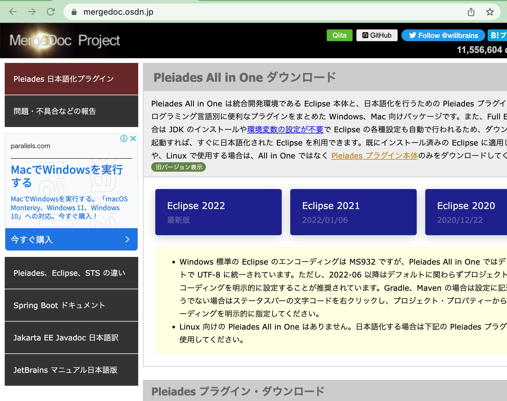
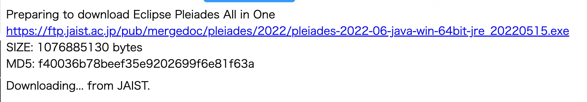

<div align="center">
    <h4>情報システム設計2022年度Webアプケーション開発環境インストールについて</h4>
</div>

<div align="right">
    2022/5/18<br>
    浅野耀介
</div>

1. 2021 年度システム設計でインストールするもの

   - 統合開発環境
   - パッケージ管理ツール
   - jav
   - ビルドツール Gradle 7.4.2
   - mysql8.0（４）

2. 統合開発環境の種類

   - Eclipse: 2022
   - Visual Studio Code(VS Code)
   - JetBrains 系(IntelliJ IDEA )

   プロジェクト作成の説明などは全て Eclipse での説明を行います。
   <u>これらの環境のいずれかがインストールされている人は、インストール作業は不要です</u>（複数が入っていても問題はありません）。

3. 統合開発環境のダウンロード

   もし何かしらの開発環境が存在する場合はこちらは行わなくていいです。（ex：応用プログラミングを受講してあり、すでに Eclipse が入っている状態など）

   3-1 もしくは 3-2 以降のどちらか一方を行ってください。今後のプロジェクト作成などは Eclipse で説明をするので、プロジェクト作成が自分自身でできない方は 3-2 の方をお勧めします)

   1. 統合開発環境 Eclipse のダウンロード

      [手順 1]

      以下の URL から「Eclipse2022」を選択します(図 1)。

      https://mergedoc.osdn.jp/

      
      <div align="center">図1：Pleiades All in Oneダウンロード画面(version選択)</div>

      [手順 2]

      OS ごとに、Java の Full Edition の Download を選択します(図 2)。

      
      <div align="center">図 2：パッケージの選択画面</div>

      [手順 3]

      選択後は図 3 のような画面に遷移し、表示された URL にアクセスするとダウンロードが開始されます(Windows の場合は zip、MacOS の場合は dmg がダウンロードされます)。ダウンロードには時間がかかるので、注意してください(容量が 1GB ほどあるためです)。

      

      [手順 4]

      ダウンロード完了後、Windows の場合 zip ファイルを C ドライブ直下において, zip ファイルを解凍、macOS の場合は dmg を実行します。

      [手順 5]

      Windows の場合は図 4 のように、表示がされていれば成功です。macOS の場合は、指示に従うとアプリケーションの中に Eclipse が配置されます。

      
      <div align="center">図 4：Eclipse.exeをファイルシステムにある画面</div>

---

1. java, Gradle,mysql のインストール

   各 PC の OS によってインストール方法が異なるのでそれぞれを参考にしてください（MacOS の方は個別で対応いたします）。

   パッケージ管理ツール（Scoop, choco）を使用することで、様々なソフトウェアを管理することができ、ユーザは管理を意識することなくソフトウェアの実行が可能になります。

   # for windows

   PowerShell を管理者権限で実行（下記 gif を参考）します。

   

   環境構築の前に、すでにインストールがされている場合かもしれない場合はに[こちら](#インストールされているかの確認)で確認してください。

   ### 制限の緩和とインストール先の設定

   Windows のデフォルトの設定では PowerShell でのスクリプトの実行が制限されています。
   今回の環境構築のスクリプトを実行するために現在、ログイン済みのユーザーに対しスクリプトの実行ポリシーを変更します。
   具体的には以下のコマンドそれぞれ一回ずつ実行します。「PS C:\Windows\system32>」以降のそれぞれ一行をコピーしエンターを押してください。

   ```powershell
   PS C:\Windows\system32> Set-ExecutionPolicy RemoteSigned -scope CurrentUser
   PS C:\Windows\system32> [environment]::setEnvironmentVariable('SCOOP','C:\Scoop','User')
   PS C:\Windows\system32> $env:SCOOP='C:\Scoop'
   ```

   一行目では実行権限を与えます。実行すると「実行ポリシーを変更しますか？」と聞かれるので「y」を入力して、エンターキーを押してください。
   ２、３行目でそれぞれの PC の環境に環境変数を設定し scoop でのアプリケーションのインストール先を変更しています。

   ### Scoop のインストール

   実際にパッケージ管理ツールの「Scoop」を以下のコマンドでダウンロードが開始されます。
   ＊下記のコマンドは一行で打ちます（～ New-Object␣System.Net.～）

   ```powershell
   PS C:\Windows\system32> Invoke-Expression (New-Object System.Net.WebClient).DownloadString('https://get.scoop.sh')
   ```

   ### Scoop で利用できる Bucket を追加

   システム設計で使用するパッケージをダウンロードするために、以下のコマンドをそれぞれ打ちます。これらは、Scoop チームが管理するサーバーで Bucket 内のアプリ情報を自動更新しているため、古いバージョンが Scoop からインストールされることを防いでいます。

   ```powershell
   PS C:\Windows\system32> scoop install git
   PS C:\Windows\system32> scoop bucket add main
   PS C:\Windows\system32> scoop bucket add extras
   PS C:\Windows\system32> scoop bucket add java
   ```

   ### java のインストール

   先ほど準備した Scoop を使用し、Java をインストールします。

   ```powershell
   PS C:\Windows\system32> scoop install openjdk
   ```

   ### Gradle のインストール

   java のビルドを実行するためにビルドツール「Gradle（グレイドル）」を使用します。こちらも先ほど準備した Scoop を使用しインストールします。以下のコマンドをにコピーしエンターを押してください。

   ```powershell
   PS C:\Windows\system32> scoop install gradle
   ```

   ### choco のインストール

   mysql をインストールするためにパッケージ管理ツールの「choco」を以下のコマンドでダウンロードが開始されます。
   ＊下記のコマンドは一行で打ちます

```powershell
PS C:\Windows\system32> Set-ExecutionPolicy Bypass -Scope Process -Force;[System.Net.ServicePointManager]::SecurityProtocol = [System.Net.ServicePointManager]::SecurityProtocol -bor 3072; Invoke-Expression ((New-Object System.Net.WebClient).DownloadString('https://chocolatey.org/install.ps1'))
```

### mysql8.0 のインストール

以下で mysql8.0 をインストールします。

もし、WSL(Windows Subsystem for Linux) 上からではなくコマンドプロンプトから mysql の実行ができる状態の場合は、インストールは不要になります。わからないこと、疑問点などがあれば、TA まで連絡ください。

WSL とは windows 上の仮想マシンの上に Linux カーネルを動作させて、Linux 環境を構築するものです。本学で開講しているデータベースを受講している場合は、こちらで環境を構築している可能性がありますが、それだけの場合は windows 上で実際に動かす際に予期せぬエラーを起こす可能性があるため、こちらのインストール手順に従い、インストールしてください。

```powershell
PS C:\Windows\system32> choco install -y mysql
```

ここまで実施出来たら一度`powershell`を閉じてください。

### インストールされているかの確認

以下の三つを確認し同様な状態な場合、環境構築は終了となります。

- gradle の version を確認

  以下のコマンドで 7.4 かを確認する。

```powershell
PS C:\Windows\System32> gradle -v

------------------------------------------------------------
Gradle 7.4.2
------------------------------------------------------------

Build time:   2022-03-31 15:25:29 UTC
Revision:     540473b8118064efcc264694cbcaa4b677f61041

Kotlin:       1.5.31
Groovy:       3.0.9
Ant:          Apache Ant(TM) version 1.10.11 compiled on July 10 2021
JVM:          17.0.2 (Oracle Corporation 17.0.2+8-86)
OS:           Windows 11 10.0 amd64
```

- java の version を確認

以下のコマンドで 17.0.x かを確認する。

```powershell
PS C:\Windows\system32> java --version
openjdk 17.0.2 2022-01-18
OpenJDK Runtime Environment (build 17.0.2+8-86)
OpenJDK 64-Bit Server VM (build 17.0.2+8-86, mixed mode, sharing)
```

- mysql の version を確認
  以下のコマンドで 8.0.x かを確認する。

```powershell
PS C:\Windows\system32> mysql --version
C:\tools\mysql\current\bin\mysql.exe  Ver 8.0.25 for Win64 on x86_64 (MySQL Community Server - GPL)
PS C:\Windows\system32>
```
